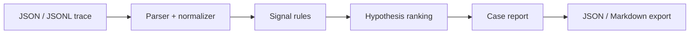

# Kedhar // Pipeline Forensics

An original, local-first failure investigation workbench for AI pipelines.

Built by **Kedhar** as a portfolio project for GitHub and LinkedIn.

## What it does

AI pipeline failures often cross several boundaries: retrieval returns weak context, a prompt exceeds a model limit, retries repeat the same invalid request, and downstream stages collapse. Individual log lines show the symptoms but rarely explain the chain.

Kedhar // Pipeline Forensics turns JSON or JSONL events into an evidence-based incident case:

- reconstructs the pipeline execution and failure chain;
- detects failure signals using deterministic, visible rules;
- ranks root-cause hypotheses with supporting evidence;
- estimates severity and downstream blast radius;
- recommends immediate containment and long-term prevention;
- exports a machine-readable analysis or Markdown incident report;
- stores recent investigations locally in the browser.

Trace data is processed in the browser and is not sent to an analysis API.

## Run locally

```bash
npm install
npm run dev
```

Open the local URL shown in the terminal and select **Load demo**.

## Test and build

```bash
npm run lint
npm test
```

The production build validates the server artifact and renders the main route.

## Supported input

The importer accepts:

1. a JSON array;
2. an object containing an `events` or `trace` array;
3. newline-delimited JSON (`.jsonl`).

Minimal example:

```json
{
  "timestamp": "2026-07-23T18:04:13.114Z",
  "run_id": "rag-prod-7f31",
  "stage": "llm_inference",
  "status": "error",
  "latency_ms": 464,
  "retry": 1,
  "error_code": "context_length_exceeded",
  "error": "Maximum context length is 16384 tokens"
}
```

The normalizer also recognizes common aliases such as `time`, `ts`, `step`, `component`, `service`, `level`, `outcome`, `duration_ms`, `attempt`, and `retry_count`.

## Explainable rulebook

| Rule | Example signals |
| --- | --- |
| Context overflow | context length, token limit, model window |
| Provider throttling | HTTP 429, rate limit, quota |
| Schema contract | parse failure, validation, malformed JSON |
| Retrieval quality | zero documents, low relevance, empty context |
| Retry storm | repeated failed attempts at the same stage |
| Latency regression | timeout or latency above a declared budget |
| Auth/configuration | HTTP 401/403, invalid key, model not found |
| Failure cascade | dependent failures after a primary error |

The analysis engine lives in [`lib/forensics.ts`](lib/forensics.ts). Each hypothesis includes the matched rule, score, evidence, and recommended actions.

## Architecture



This release is intentionally local-first. The browser-only design is easy to audit and demonstrate without exposing private pipeline logs or maintaining a backend.

## Suggested roadmap

- OpenTelemetry span ingestion
- healthy-versus-failed trace comparison
- user-defined YAML rules
- token and cost anomaly detection
- optional team case comments
- connectors for common pipeline orchestrators

## Originality

The product interface, copy, visual identity, sample trace, scoring logic, and source code in this repository were created specifically for this project. It does not bundle copied product assets or proprietary datasets.

Before commercial use, perform your own trademark and legal review.

## Author

**Kedhar**  
AI / Cloud / Software Engineering portfolio project

## License

[MIT](LICENSE) — Copyright © 2026 Kedhar.
